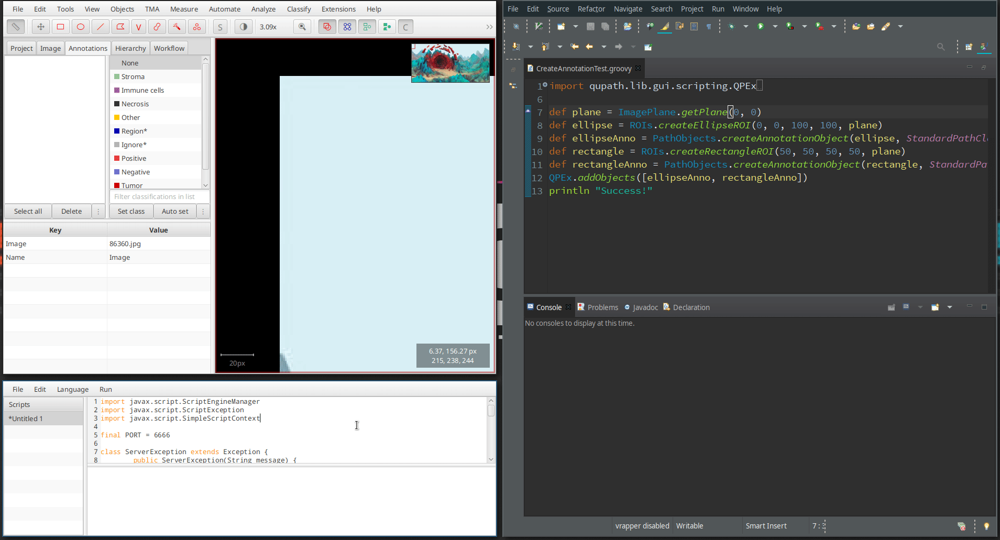
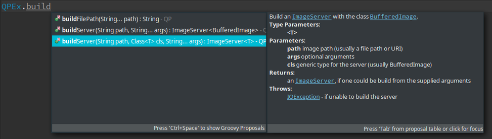
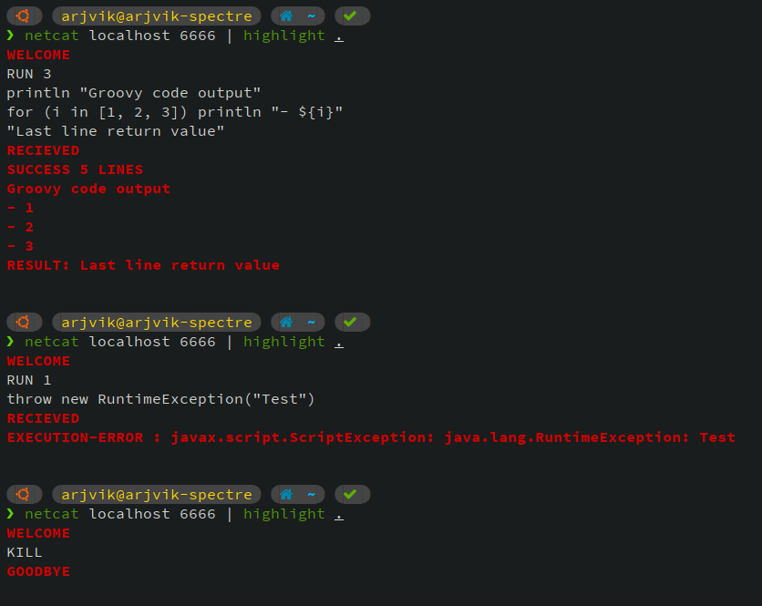

# QuPath Scripting Tools

[QuPath](https://github.com/qupath/qupath) is an open-source (GPLv3) bioimage analysis and annotation toolkit written in Java.
One of it's core features is its scriptability via the Java Scripting Engine using Groovy.
However, QuPath only allows running scripts edited via its own rudimentary editing interface.
This project provides a way to develop and run scripts from Eclipse, or any other Groovy-capable IDEs.
It is also a fully-complete Eclipse project that can be used as a starting point to write new QuPath scripts, providing out-of-the-box autocomplete and javadocs for QuPath's script APIs.

### Table of Contents

* [Demo](#demo)
   * [Autocomplete and Javadoc integration](#autocomplete-and-javadoc-integration)
   * [Raw TCP Protocol](#raw-tcp-protocol-will-almost-certainly-change-over-time)
* [Instructions](#instructions)
   * [Use within Eclipse](#use-within-eclipse)
   * [External use](#external-use)
   * [Remote use](#remote-use)

## Demo



The bottom left window is the QuPath scripting window. It is used to run [`RemoteCodeServer.groovy`](../tools/RemoteCodeServer.groovy). The right window is Eclipse, which uses [`RemoteCodeClient.groovy`](../tools/RemoteCodeClient.groovy) to run the open script.

### Autocomplete and Javadoc integration



### Raw TCP Protocol (will almost certainly change over time)



(White is client request, Red is server response)

## Instructions

### Use within Eclipse

1. Clone the repository (including submodules) to a local directory on your machine:

   ```shell
   git clone https://github.com/arjvik/QuPath-Scripting-Tools --recursive QuPath-Scripts
   ```

2. Import the repository into Eclipse:

   - Go to `File` > `Import...`.
   - Under `General`, select `Existing Projects into Workspace`.
   - Click `Browse`, and select the project that you just cloned (the root `QuPath-Scripts` folder, or whatever you named it when you cloned it).
   - Select `Finish`, then open the project.
   - If you wish, you can rename the project to `QuPath-Scripts`, because it will contain all your newly created scripts.

3. Launch `RemoteCodeServer.groovy` from within QuPath. You can either browse to the `QuPath-Scripts/tools` directory from within QuPath or copy-paste the script into the QuPath script editor. Watch the console for a line that says `INFO: Starting socket`

4. Install the run configurations so that you can launch scripts with a single button press from Eclipse:

   - Open `src/HelloWorld.groovy` (will be labeled `(default package)`) from the Package Explorer pane on the left.
   - Make sure the `HelloWorld.groovy` editor pane has focus before following the next steps, or you will get a cryptic error about not finding a project.
   - Click the arrow on the right of the`External Tools` button in the top toolbar (green play button with a red toolbox, looks like ).
   - Select `External Tool Configurations...`. In the left column, double click on `Run on QuPath`. If the QuPath server is running, you should see the output from the `HelloWorld.groovy` script in the console. If not, you will see a stack trace in red.
   - Repeat this process for `Kill QuPath RemoteCodeServer` as well. If the  QuPath server is running, you will get a message that says "Server exited properly.
   - Once this process is over, Eclipse will remember these run configurations and you will not need to open External Tool Configurations again.

5. Create or edit Groovy scripts in the `src/` folder. For testing purposes, you can run the existing [`src/CreateAnnotationTest.groovy`](../tools/CreateAnnotationTest.groovy) (make sure you have an image open in QuPath for it to work). Run the script by selecting `Run on QuPath` from the External Tools overflow menu (again making sure the editor pane has focus).

   - If you directly click the External Tools button, it will run the last run configuration that you used, saving you one click.
   - In order to allow general Eclipse functionality such as refactoring, syntax highlighting, etc to work, you will need to install the [Groovy plugin for Eclipse](https://marketplace.eclipse.org/content/groovy-development-tools).
   - Once this is installed, you should be able to autocomplete QuPath functions and view their javadocs out of the box (assuming you passed `--recursive` to the git clone command above)

6. If you want to interact with QuPath again (QuPath doesn't allow UI interactions when a script is running), select `Kill QuPath RemoteCodeServer`  from the External Tools overflow menu. Make sure to launch the server again from QuPath (following step 3) before running scripts again.

### External use

Run the script [`RemoteCodeServer.groovy`](../tools/RemoteCodeServer.groovy) inside QuPath from the script editor (see step 3 above).

The client script [`RemoteCodeClient.groovy`](../tools/RemoteCodeClient.groovy) can be used to execute a script from the command line:

```shell
groovy tools/RemoteCodeClient.groovy path/to/script.groovy
```

It can also be embedded into an IDE as an external tool (much like was done for Eclipse above).

To kill the TCP server, pass the `--kill` switch instead of a script:

```shell
groovy tools/RemoteCodeClient.groovy --kill
```

### Remote use

One of the advantages of using a TCP socket to communicate between the client and server is that TCP can be used between two different machines. This can be handy if you are running QuPath on an HPC cluster to take advantage of greater computing resources, but you want to use an IDE on your own computer.

`RemoteCodeServer.groovy` listens on port `6666` and `RemoteCodeClient.groovy`  attempts to connect to `localhost:6666` by default. This can be changed easily, however.

The easiest way to set up a networked connection between the client and server is via ssh port forwarding. Start QuPath on the host, and run the server script. Then run the following ssh command from your local computer:

```bash
ssh user@host -L 6666:localhost:6666
```

Any connections to `localhost:6666` will be forwarded automatically to `host:6666`. You can then use `RemoteCodeClient.groovy` without any changes.
